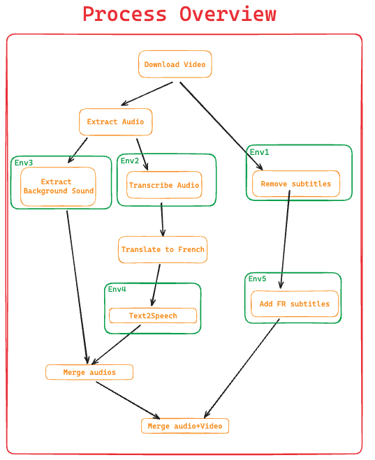

# Content Translator

## Overview

This project aim to repurpose content in other languages from different platform. this is the overview of the process. many processing are applied to perform a series of operations on a video. It downloads a video, removes its subtitles, extracts and processes its audio, translates the audio, synthesizes the translated text into speech, merges the synthesized audio with the background sound, and adds subtitles to the video.

<a href="https://excalidraw.com/#json=m_joa1vpb4hxL8DI_83-8,JuI2V8rqqiBYAFUYixCvGQ"> Excalidraw Architecture Diagram</a>



## Features:

- Download Video: Download a video from a given URL.
- Remove Subtitles: Remove existing subtitles from the video.
- Extract Audio: Extract audio from the video.
- Transcribe Audio: Transcribe the extracted audio.
- Translate to French: Translate the transcribed text to French.
- Text-to-Speech: Convert the translated text to speech.
- Extract Background Sound: Extract background sound from the original audio.
- Merge Audios: Merge the synthesized speech with the background sound.
- Merge Audio with Video: Merge the final audio with the video.
- Add Subtitles: Add French subtitles to the video.

## Environement Setup

Install Conda
Python 3.10
Cuda 11.7

1. Clone the repository:

   ```bash
   git clone https://github.com/idrisrupt/ContentTranslator.git
   cd video_processing_tool
   ```

2. Install Env:
   ```bash
   conda create -n me python=3.10.12
   conda install paddlepaddle-gpu==2.6.1 -c https://mirrors.tuna.tsinghua.edu.cn/anaconda/cloud/Paddle/ -c conda-forge
   conda install pytorch==2.1.0 torchvision==0.16.0 pytorch-cuda=11.7 -c pytorch -c nvidia
   pip install -r requirements.txt
   ```

## Processing

## Improvements

- Youtube Upload
  Youtube API (limit to 6 videos daily)
  use youtube selenium uploader
- Platform where to post:
  Youtube
  Tiktok
  Facebook
  Instagram
  Dailymotion
- Telegram Alterting
